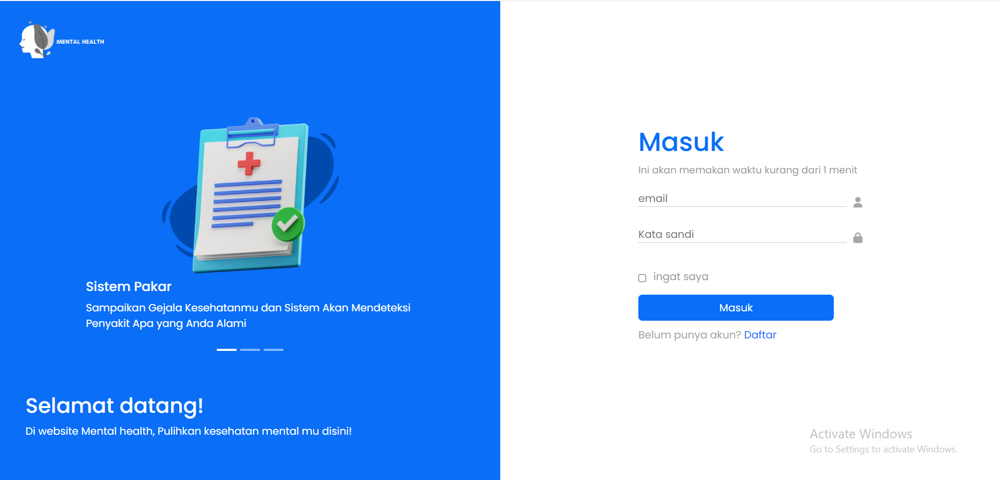
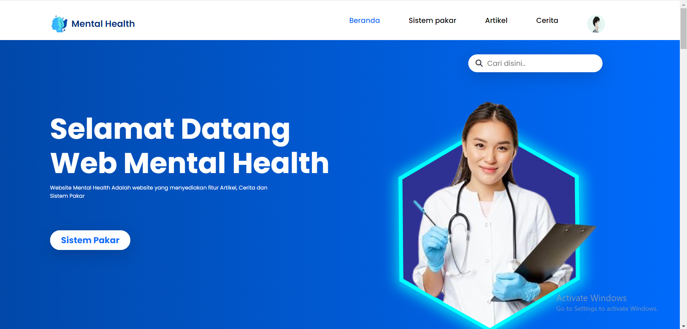
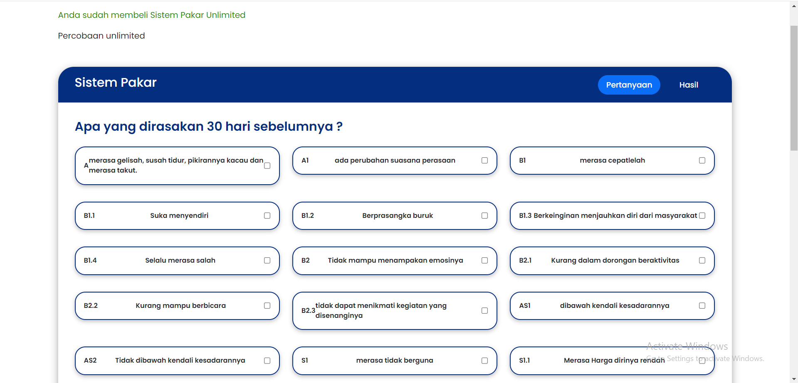
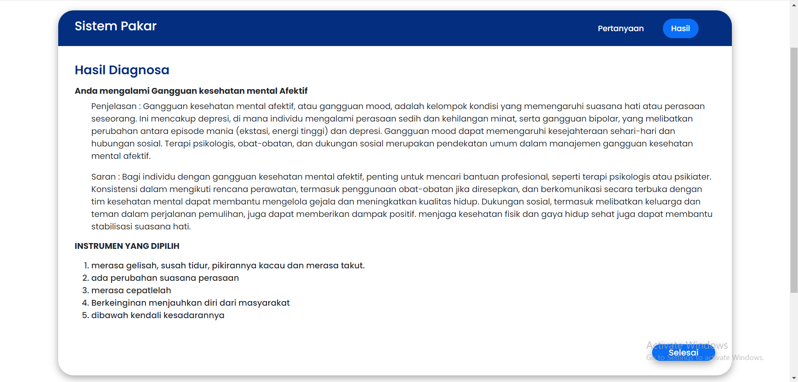
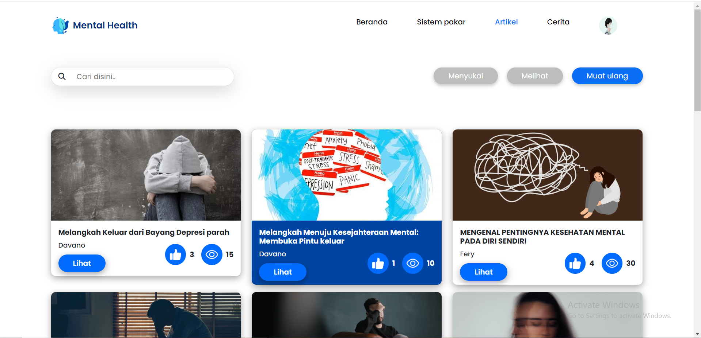
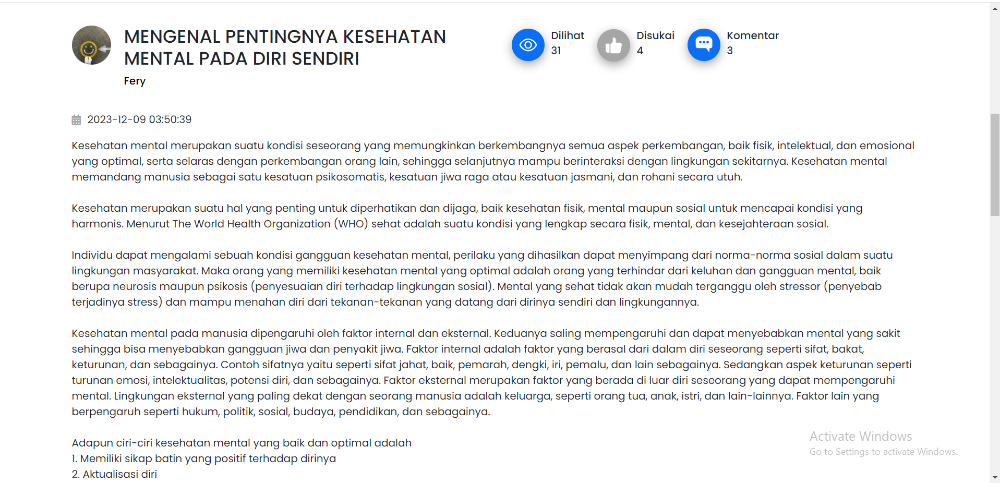
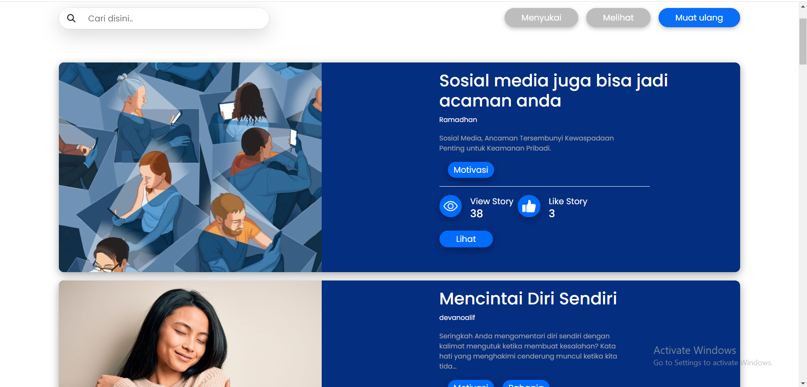
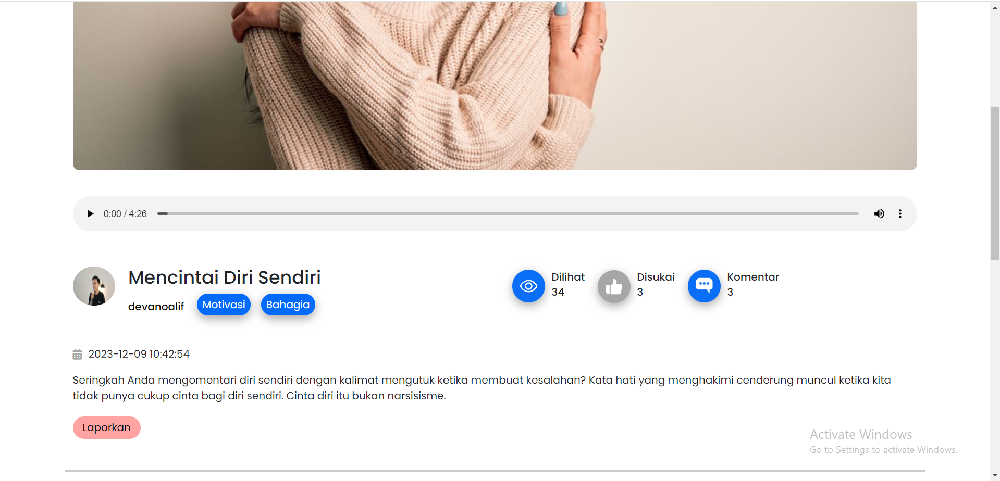
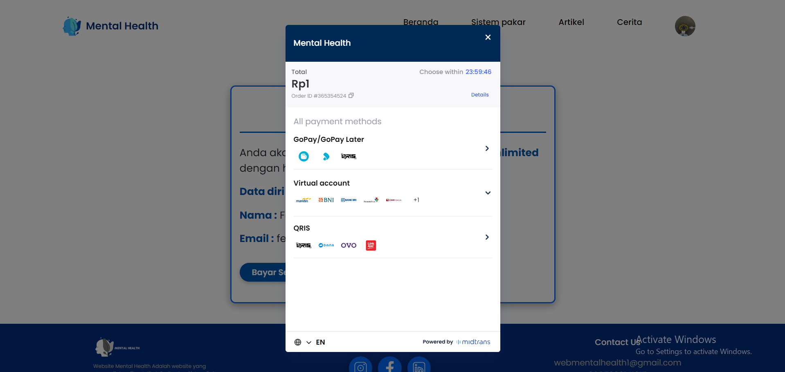

<h1>Teknologi yang digunakan</h1>
<ul>
 <li>PHP - Laravel</li>
 <li>Cloudinary</li>
 <li>Midtrans</li>
 <li>Mysql</li>
 <li>HTML</li>
 <li>CSS</li>
 <li>Bootstrap</li>
</ul>

<h1>Tampilan Website</h1>
<ul>

 <li>Halaman Login</li>
  
 
    
 <li>Beranda - Semua </li>
 
 

 
<li>Fitur Sistem Pakar</li>
 
 

 
 <li>Hasil Sistem Pakar </li>
 
 

 
 <li>List Artikel </li>
 
 

 <li>Detail Artikel </li>
 
 

 <li>List Cerita </li>
 
 

 <li>Detail Cerita </li>
 
 

 <li>Pembayaran Midtrans </li>
 
 

</ul>
